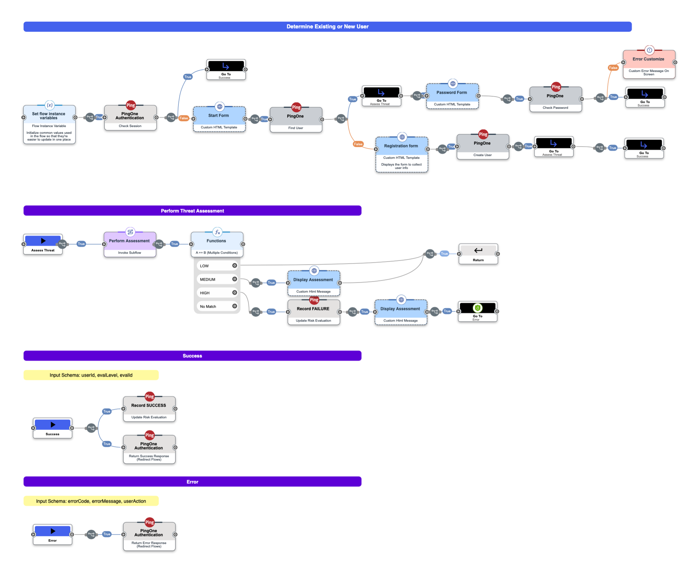

# PingOne Protect - DaVinci Flows

The app integration with OIDC uses a DaVinvi Policy to execute the P1 Protect - Signals SDK within the UX presented in a DaVinci Flow.

Not only does that generate the SDK Payload, DV also makes the Evaluation request to PingOne Protect **and** performs different enforcement of LOW | MEDIUM | HIGH decisions.

## Level Enforcement

| Level | Eval Updated | Flow Action |
| --- | --- | --- |
| LOW | SUCCESS | User authenticated and returned to app |
| MEDIUM | SUCCESS | Intersital displayed showing Eval details. User Authenticated and returned to app |
| HIGH | FAILED | Intersital displayed showing Eval details. User Authenticated and returned to app |

In all cases, the `evalLevel` is placed into the `id_token` so it can be accessed by the application.

## New Device notification

The Threat assessment is performed in a SubFlow that detects that a New Device is being used, and will send a PingOne Notification to the Email address of the User.

## Flow Images

There are 2 Flows using - the main one that controls the User Journey, and a subflow that performs the P1 Protect decision and handles the New Device notification.

Main Flow:

SubFlow:
